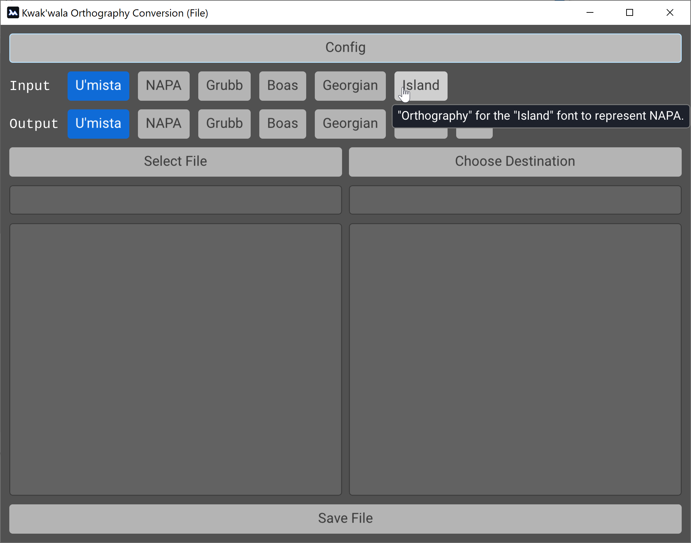

# Converting Tables with LibreOffice Calc

To convert excel/calc/spreadsheet files between 
orthographies, you'll need to strip out the English
cells and convert them to CSV format. This guide shows
you how to do this in LibreOffice Calc.

## Converting to CSV

First, you need to open the spreadsheet in LibreOffice Calc.

Then, select the first English cell. Next, hold `Shift`
and select the last English cell

Then, press `Delete` to strip the English cells away. 
If you have multiple discontinuous sections of English,
you'll have to repeat this for each section.

Next, you need to save this file as a `.csv` file. To do
this, first click `File` in the top left-hand corner
and select `Save as...`. Alternatively, you can press
`Ctrl+Shift+S`.

This will bring up a dialog where you can select where
to save the file. First, navigate to the directory where
you wish to save the file, click the drop-down box
next to `Save as type`, and select `Text CSV (*.csv)`.

Next, name the file as you want, and click `Save`.

This (may) open a dialog asking if you want to save as a 
`.csv`. Just click `Use Text CSV Format` to continue.

Next, the following dialog will come up. Make sure that
`Character set` is set to `Unicode (UTF-8)`. 
`Field Delimiter` should be set to `,`. These should
already be the settings selected, but in case they aren't,
set them as displayed. Then, click `OK` to save the file.

## Converting Orthography

Next, you need to run `kwak-gui-file` to convert the
`.csv` file to a different orthography.

First, open up `kwak-gui-file.exe` in its directory.

Next, select the input and output orthographies. If you
mouse overt the orthographies, a brief description will
pop up.

Then, click on `Select File` to open up a dialog to
select the file you want.

This will open up the file in, allowing you to see its
contents, and a preview of the converted content. If
either the input or output orthography is incorrect,
you can select the correct orthographies.

Now, you can select `Choose Destination` to choose
where to save, and its file name.

You can type the new file name in the `File Name`
box. Remember to end the filename in `.csv` to
ensure that it is interpreted as such when
re-importing it.

This will add the destination file into the small
box directly below the `Choose Destination` button.
If it doesn't, you can try clicking the smaller
`(Manual)` button to the right of the `Choose Destination`
button. For more info on how to do this, jump down
to the "Manually Selecting Output File" section.

Now, you just need to press `Save File` at the bottom
of the window, which will actually output the converted
file.

If the file saved successfully, a box that says
`File Saved Successfully` should pop up. 

If the file doesn't save correctly, an error message 
may show up. If this happens, you can close the program
and try again.

## Re-opening in LibreOffice

Now, go into LibreOffice Calc and click `File > Open`
or press `Ctrl+O`. This will allow you to open the
`.csv` file that you just saved from `kwak-gui-file`.

This will open up a window where you select the options
for importing the `.csv` file's contents. You can
probably leave this as-is, but you may want to de-select
`Semicolon` if your text contains semicolons. After 
selecting the options correctly, click `OK` to import
the file.

Now, you have your converted cells in the new orthography.
You can again copy the cells to another file, or do
whatever you want with the data in question.

## Manually Selecting Output File

(Only in versions from 2023-03-30 onwards)

If you've tried selecting the output file with the
"Choose Destination" button and nothing happens,
you can also select where to save the file manually.

First, click on the small `Manual` button next to
"Choose Destination".

This will open up a small area where you can enter
where to save your file directly, in the top text box.

(Note that the "Error" Box does not mean that an
error has occurred; it's simply the space where
the output entry puts writes any errors that
occur when trying to select an output file.)

If you wish to save your file in the same directory as
your input file, you can click on `Copy Input Directory`
to copy the directory of your input to the output
text box.

If you try and click `Done` without entering anything
further, an error will occur, since the program will
assume you are trying to save a file with the same
path as your directory.

Instead, click in the top text box, scroll to the
end (you can press the `End` key on your keyboard
if you have an `End` key to scroll to the end 
automatically), type a `\` (backslash, usually located
above or near the `Enter`/`Return` key), and then type
the name of the file you want. __Remember to end the
name of your file in `.csv`.__

If you then click `Done`, the program should return to
the main screen, where the output file path is written
below the `Choose Destination` button.

However, you may get an "Output directory does not exist"
error. This will happen if you accidentally changed the
path at all while entering your file name, or if you
placed the file in a subdirectory that does not yet
exist.

If this happens, you can check to see if there's an
obvious typo and correct it, or just click `Copy Input
Directory` again, scroll to the end (click the top
text box and hold down the right arrow on your
keyboard until it stops scrolling), type `\` followed
by your file name (__again ending in `.csv`__), and
try clicking `Done` again. 

If you still get an error, you can click `Cancel` to
give up on using manual input entry, closing the program,
and trying again with the main output entry tool (i.e. 
clicking `Choose Destination`). If that still doesn't
work, try restarting your computer.